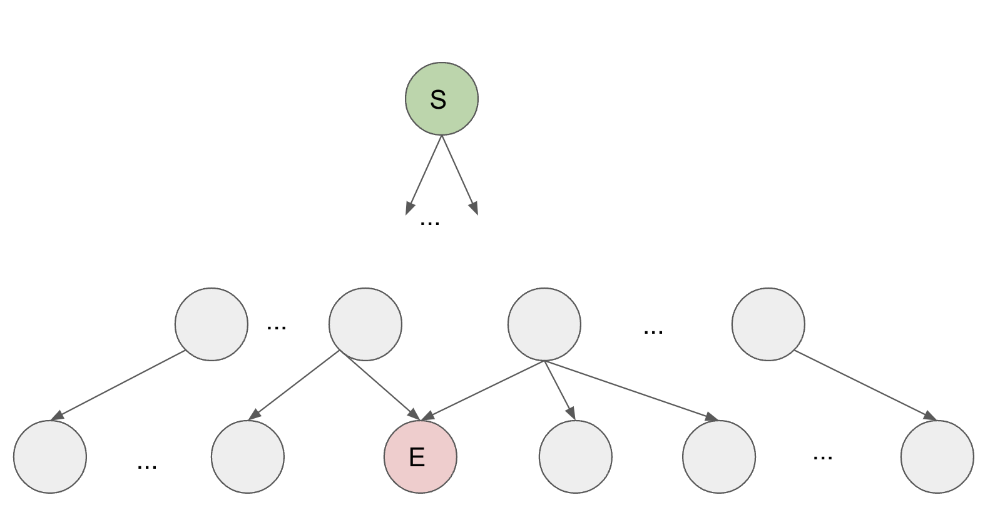
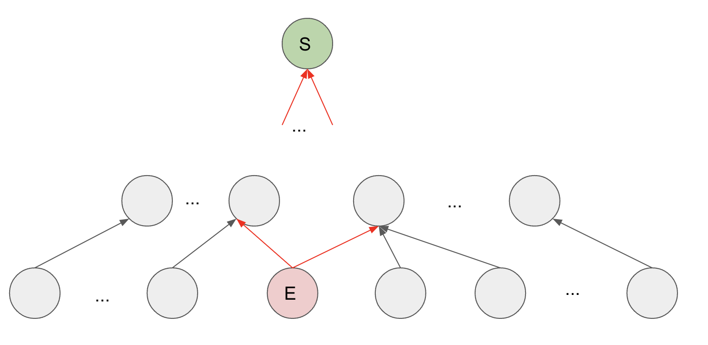
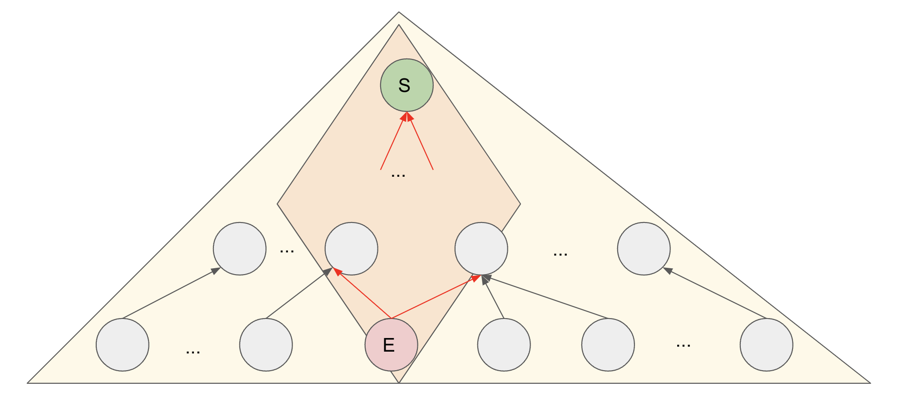

# 126. Word Ladder II - Hard

A transformation sequence from word `beginWord` to word `endWord` using a dictionary `wordList` is a sequence of words <code>beginWord -> s<sub>1</sub> -> s<sub>2</sub> -> ... -> s<sub>k</sub></code> such that:

- Every adjacent pair of words differs by a single letter.
- Every <code>s<sub>i</sub></code> for `1 <= i <= k` is in `wordList`. Note that `beginWord` does not need to be in wordList.
- <code>s<sub>k</sub> == endWord</code>

Given two words, `beginWord` and `endWord`, and a dictionary `wordList`, return all the shortest transformation sequences from `beginWord` to `endWord`, or an empty list if no such sequence exists. Each sequence should be returned as a list of the words <code>[beginWord, s<sub>1</sub>, s<sub>2</sub>, ..., s<sub>k</sub>]</code>.

##### Example 1:

```
Input: beginWord = "hit", endWord = "cog", wordList = ["hot","dot","dog","lot","log","cog"]
Output: [["hit","hot","dot","dog","cog"],["hit","hot","lot","log","cog"]]
Explanation: There are 2 shortest transformation sequences:
"hit" -> "hot" -> "dot" -> "dog" -> "cog"
"hit" -> "hot" -> "lot" -> "log" -> "cog"
```

##### Example 2:

```
Input: beginWord = "hit", endWord = "cog", wordList = ["hot","dot","dog","lot","log"]
Output: []
Explanation: The endWord "cog" is not in wordList, therefore there is no valid transformation sequence.
```

##### Constraints:

- `1 <= beginWord.length <= 5`
- `endWord.length == beginWord.length`
- `1 <= wordList.length <= 500`
- `wordList[i].length == beginWord.length`
- `beginWord`, `endWord`, and `wordList[i]` consist of lowercase English letters.
- `beginWord != endWord`
- All the words in `wordList` are unique.
- The sum of all shortest transformation sequences does not exceed <code>10<sup>5</sup></code>.

## Solution

```
# Time: O(n * k^2)
# Space: O(n * k^2)
class Solution:
    def findLadders(self, beginWord: str, endWord: str, wordList: List[str]) -> List[List[str]]:
        k = len(beginWord)
        words = set(wordList)
        words.add(beginWord)
        g = defaultdict(set)
        for w in words:
            for i in range(k):
                g[w[:i] + "*" + w[i + 1:]].add(w)
        
        q = deque([beginWord])
        parents = defaultdict(set)
        depths = {beginWord: 1}
        while q:
            curr = q.popleft()
            if curr == endWord:
                break
            
            for i in range(k):
                transform = curr[:i] + "*" + curr[i + 1:]
                for neighbor in g[transform]:
                    if neighbor not in depths:
                        depths[neighbor] = depths[curr] + 1
                        q.append(neighbor)
                        parents[neighbor].add(curr)
                    elif depths[neighbor] > depths[curr]:
                        parents[neighbor].add(curr)

        builder, result = [], []
        def dfs(w):
            builder.append(w)
            if w == beginWord:
                result.append(builder[::-1])
            else:
                for child in parents[w]:
                    dfs(child)
            builder.pop()
        
        dfs(endWord)
        return result
```

## Notes
- This is a pretty difficult problem for a beginner or even intermediate level algorithms person, in part because test cases are strict on runtime. You will TLE over and over and over if you are not careful about how you go about obtaining all minimum length ladders! Since we need to return all min length ladders, we will need to do dfs. However, simple dfs on raw input to generate all ladders and filtering to only min length ladders will cause a TLE because of the exponentially large number of possible word ladders... we are dealing with an undirected, (probably) cyclic graph in this problem. The number of nodes in the graph is limited to only 500 in this problem, so that says a lot undirected graphs with cycles.
- Before diving into the graph aspects of this problem, it is important to note the use of the wildcard map that serves as our graph `g`. It links neighbors into the same set based on the letters surrounding a single mismatch character. It is faster to build the graph with this approach because `k` upper bound is `5` for this problem, compared to `500` for `len(wordList)`. The naive approach of comparing each word to each other word to build `g` as an adjacency list would still work for this problem due to low input constraints but is less efficient.
- The main trick to this problem is modeling the relationships between `beginWord` and the words in `wordList` as a graph. The natural form for this graph is an undirected, potentially cyclic graph; performing dfs on such a graph will lead to TLE for obvious reasons since we do not eliminate excess ladders even if we avoid cycles, so we need to translate our naive undirected cyclic graph to a DAG. This will prevent non-minimum length ladders from showing up in our answer. If we perform bfs on the undirected graph starting from `beginWord`, we can convert to a DAG. We need to be careful about how we go about doing this transformation, however, because for nodes in the same bfs level that have an edge between them, we want to avoid adding a directed edge between them in our converted DAG. Also note the difference between this kind of DAG (one root node and a bunch of layered descendants) and tree; children could have multiple parents here, whereas in a tree they can only have one parent; we want any multi-parent edges showing up in our converted DAG. 
- The final gotcha for this approach is that it is still not enough to simply convert to the correct form of DAG and then run dfs on it from `beginWord`; because of the strict runtime limits on leetcode, we need to start dfs from `endWord`. In terms of time complexity, this shouldn't make a difference, but not doing it to will cause a TLE on leetcode, and I think it is because they want to teach people the difference between dfs on a tree vs. DAG/bidirectional bfs. By building the DAG such that our directed edges are set up for dfs from `endWord`, despite the fact that we build the DAG with bfs starting from `beginWord`, we enable ourselves to prune the search space to a fusiform shape. See below pictures for visualization. It seems to have a similar effect on runtime as bidirectional bfs.



- Because this approach is akin to bidirectional bfs, and does very will percentile wise (80+ runtime consistently) on leetcode, not going to show a bidirectional bfs approach here, but also works for this problem. 