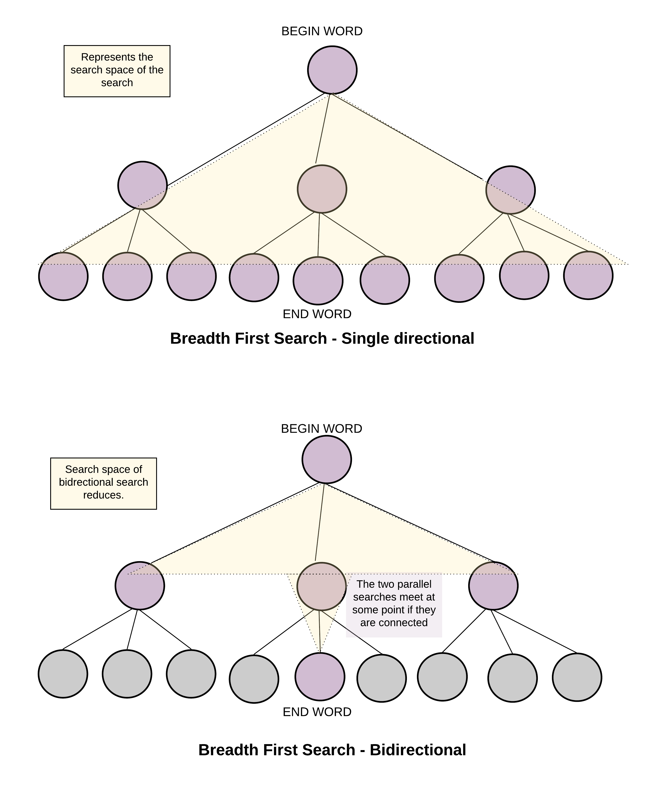

# 127. Word Ladder - Hard

A transformation sequence from word `beginWord` to word `endWord` using a dictionary `wordList` is a sequence of words <code>beginWord -> s<sub>1</sub> -> s<sub>2</sub> -> ... -> s<sub>k</sub></code> such that:

- Every adjacent pair of words differs by a single letter.
- Every <code>s<sub>i</sub></code> for `1 <= i <= k` is in `wordList`. Note that beginWord does not need to be in `wordList`.
- <code>s<sub>k</sub> == endWord</code>

Given two words, `beginWord` and `endWord`, and a dictionary `wordList`, return the number of words in the shortest transformation sequence from `beginWord` to `endWord`, or `0` if no such sequence exists.

##### Example 1:

```
Input: beginWord = "hit", endWord = "cog", wordList = ["hot","dot","dog","lot","log","cog"]
Output: 5
Explanation: One shortest transformation sequence is "hit" -> "hot" -> "dot" -> "dog" -> cog", which is 5 words long.
```

##### Example 2:

```
Input: beginWord = "hit", endWord = "cog", wordList = ["hot","dot","dog","lot","log"]
Output: 0
Explanation: The endWord "cog" is not in wordList, therefore there is no valid transformation sequence.
```

##### Constraints:

- `1 <= beginWord.length <= 10`
- `endWord.length == beginWord.length`
- `1 <= wordList.length <= 5000`
- `wordList[i].length == beginWord.length`
- `beginWord`, `endWord`, and `wordList[i]` consist of lowercase English letters.
- `beginWord != endWord`
- All the words in `wordList` are unique.

## Solution 1

```
# Time: O(n * k^2)
# Space: O(n * k^2)
class Solution:
    def ladderLength(self, beginWord: str, endWord: str, wordList: List[str]) -> int:
        words = set(wordList)
        words.add(beginWord)
        if endWord not in words:
            return 0
        if endWord == beginWord:
            return 1
        
        g = defaultdict(list)
        k = len(wordList[0])
        for w in words:
            for i in range(k):
                wc = w[:i] + "*" + w[i + 1:]
                g[wc].append(w)
        
        curr = set([beginWord])
        result = 0
        visited = set()
        while curr:
            result += 1
            nxt = set()
            for w in curr:
                if w == endWord:
                    return result
                visited.add(w)
                for i in range(k):
                    wc = w[:i] + "*" + w[i + 1:]
                    for neighbor in g[wc]:
                        if neighbor in visited or neighbor in curr:
                            continue
                        nxt.add(neighbor)
            curr = nxt
            
        return 0
```

## Notes
- Fairly straightforward bfs problem, the tricky part for newer algo people will be figuring out how to deal with TLE from naively checking every string against every other string for single character difference, which is <code>O(n<sup>2</sup> * k)</code>. The solution to this problem is using wildcards (`wc`) to remember which words are neighbors with each other in our graph, which is only <code>O(k<sup>2</sup> * n)</code> to build. This is not a typical way of tracking adjacency in a graph but works for this problem. In general if graph construction is a slow step in terms of time complexity it is good to consider cheaper ways of performing that step so the main part of the algorithm is responsible for the upper bound on time complexity.
- The reason I used sets to track current and next layers during bfs was to be able to look out for edges between nodes in the same layer, which is definitely possible in this kind of input.

## Solution 2

```
# Time: O(n * k^2)
# Space: O(n * k^2)
class Solution:
    def ladderLength(self, beginWord: str, endWord: str, wordList: List[str]) -> int:
        words = set(wordList)
        words.add(beginWord)
        if endWord not in words:
            return 0
        if endWord == beginWord:
            return 1
        
        g = defaultdict(list)
        k = len(wordList[0])
        for w in words:
            for i in range(k):
                wc = w[:i] + "*" + w[i + 1:]
                g[wc].append(w)
        
        visited = set()
        curr1, curr2 = set([beginWord]), set([endWord])
        result = 0
        while curr1 and curr2:
            result += 1
            if len(curr1) > len(curr2):
                curr1, curr2 = curr2, curr1
            
            nxt = set()
            for w in curr1:
                if w in curr2:
                    return result
                visited.add(w)
                for i in range(k):
                    wc = w[:i] + "*" + w[i + 1:]
                    for neighbor in g[wc]:
                        if neighbor in visited or neighbor in curr1:
                            continue
                        nxt.add(neighbor)
            curr1 = nxt
            
        return 0
```

## Notes
- This is bidirectional bfs, and significantly prunes search space for inputs where there are a lot of words in `wordList` and the shortest path between `beginWord` and `endWord` is long. See pictures below.
