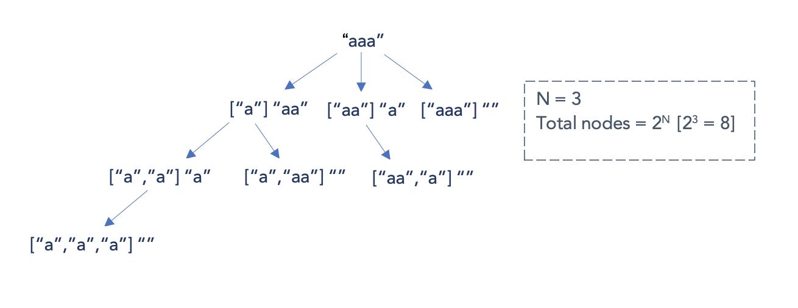

# 131. Palindrome Partitioning - Medium

Given a string `s`, partition `s` such that every substring of the partition is a palindrome. Return all possible palindrome partitioning of `s`.

##### Example 1:

```
Input: s = "aab"
Output: [["a","a","b"],["aa","b"]]
```

##### Example 2:

```
Input: s = "a"
Output: [["a"]]
```

##### Constraints:

- 1 <= s.length <= 16
- s contains only lowercase English letters.

## Solution

```
# Time: O(n * 2^n)
# Space: O(n * 2^n)
class Solution:
    def partition(self, s: str) -> List[List[str]]:
        pals = defaultdict(list)
        def collectPal(l, r):
            first, last = l, r
            while l <= r:
                if s[l] != s[r]:
                    break
                l += 1
                r -= 1
            if l > r:
                pals[last].append(s[first:last + 1])
        
        n = len(s)
        for l in range(n):
            for r in range(l, n):
                collectPal(l, r)
        
        result, builder = [], []
        def buildPartitions(i):
            if i < 0:
                result.append(builder[::-1])
                return
            
            for palEndingHere in pals[i]:
                builder.append(palEndingHere)
                buildPartitions(i - len(palEndingHere))
                builder.pop()
        
        buildPartitions(n - 1)
        return result
```

## Notes
- This approach finds all palindromic substrings and then builds all possible partitions using them via backtracking.
- The time complexity is <code>O(n * 2<sup>n</sup>)</code> because in the worst case with an input with all the same character i.e. `"aaaaa"`, all possible substrings are palindromes. In a case like this, for each character we have two choices: either add the character to the previous palindrome or treat the character as its own palindrome of length 1. This will result in a binary recursive call tree. See image below:


## Solution 2

```
# Time: O(mn)
# Space: O(mn)
class Solution:
    def partition(self, s: str) -> List[List[str]]:
        pals = defaultdict(list)
        n = len(s)
        dp = [[False] * n for _ in range(n)]
        for sr in range(n):
            l, r = 0, sr
            while r < n:
                if l == r:
                    dp[l][r] = True
                elif l == r - 1:
                    dp[l][r] = s[l] == s[r]
                else:
                    dp[l][r] = s[l] == s[r] and dp[l + 1][r - 1]
                if dp[l][r]:
                    pals[r].append(s[l:r + 1])
                l += 1
                r += 1
        
        result, builder = [], []
        def buildPartitions(i):
            if i < 0:
                result.append(builder[::-1])
                return
            
            for palEndingHere in pals[i]:
                builder.append(palEndingHere)
                buildPartitions(i - len(palEndingHere))
                builder.pop()
        
        buildPartitions(n - 1)
        return result
```

## Notes
- This approach is a slight improvement over the previous one because we use dp to enumerate all palindromic substrings in <code>O(n<sup>2</sup>)</code> time as opposed to <code>O(n<sup>3</sup>)</code> time.