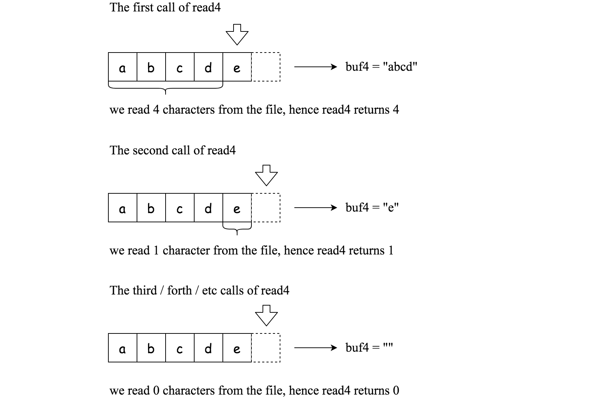

# 157. Read N Characters Given Read4 - Easy

Given a `file` and assume that you can only read the file using a given method `read4`, implement a method to read `n` characters.

Method read4:

The API `read4` reads four consecutive characters from `file`, then writes those characters into the buffer array `buf4`.

The return value is the number of actual characters read.

Note that `read4()` has its own file pointer, much like `FILE *fp` in C.

Definition of `read4`:

```
    Parameter:  char[] buf4
    Returns:    int

buf4[] is a destination, not a source. The results from read4 will be copied to buf4[].
```

Below is a high-level example of how `read4` works:



```
File file("abcde"); // File is "abcde", initially file pointer (fp) points to 'a'
char[] buf4 = new char[4]; // Create buffer with enough space to store characters
read4(buf4); // read4 returns 4. Now buf4 = "abcd", fp points to 'e'
read4(buf4); // read4 returns 1. Now buf4 = "e", fp points to end of file
read4(buf4); // read4 returns 0. Now buf4 = "", fp points to end of file
```

##### Example 1:

```
Input: file = "abc", n = 4
Output: 3
Explanation: After calling your read method, buf should contain "abc". We read a total of 3 characters from the file, so return 3.
Note that "abc" is the file's content, not buf. buf is the destination buffer that you will have to write the results to.
```

##### Example 2:

```
Input: file = "abcde", n = 5
Output: 5
Explanation: After calling your read method, buf should contain "abcde". We read a total of 5 characters from the file, so return 5.
```

##### Example 3:

```
Input: file = "abcdABCD1234", n = 12
Output: 12
Explanation: After calling your read method, buf should contain "abcdABCD1234". We read a total of 12 characters from the file, so return 12.
```

##### Constraints:

- `1 <= file.length <= 500`
- `file` consist of English letters and digits.
- `1 <= n <= 1000`

## Solution

```
# Time: O(n)
# Space: O(1)
class Solution:
    def read(self, buf, n):
        """
        :type buf: Destination buffer (List[str])
        :type n: Number of characters to read (int)
        :rtype: The number of actual characters read (int)
        """
        k = 0
        temp = [None] * 4
        while 1:
            read = read4(temp)
            for i in range(min(read, 4)):
                buf[k] = temp[i]
                k += 1
                if k == n:
                    return k
            if read < 4:
                return k
```

## Notes
- Straightforward once you understand the prompt, which could be clearer to begin with but especially unfriendly to beginners. Need to watch out for edge case where `n` is greater than the file length and edge case where `n` is not a multiple of `4`, both result in `buf` needing to have `< 4` characters read into it.