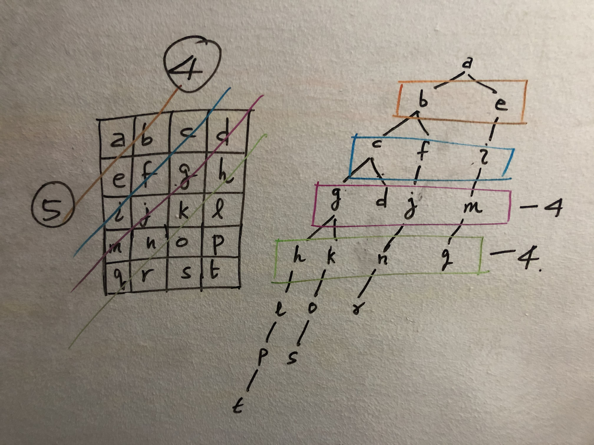

# 200. Number of Islands - Medium

Given an `m x n` 2D binary grid `grid` which represents a map of `'1'`s (land) and `'0'`s (water), return the number of islands.

An island is surrounded by water and is formed by connecting adjacent lands horizontally or vertically. You may assume all four edges of the grid are all surrounded by water.

##### Example 1:

```
Input: grid = [
  ["1","1","1","1","0"],
  ["1","1","0","1","0"],
  ["1","1","0","0","0"],
  ["0","0","0","0","0"]
]
Output: 1
```

##### Example 2:

```
Input: grid = [
  ["1","1","0","0","0"],
  ["1","1","0","0","0"],
  ["0","0","1","0","0"],
  ["0","0","0","1","1"]
]
Output: 3
```

##### Constraints:

- `m == grid.length`
- `n == grid[i].length`
- `1 <= m, n <= 300`
- `grid[i][j]` is `'0'` or `'1'`.

## Solution

```
# Time: O(mn)
# Space: O(min(m, n))
class Solution:
    def numIslands(self, grid: List[List[str]]) -> int:
        diffs = ((0, -1), (0, 1), (-1, 0), (1, 0))
        m, n = len(grid), len(grid[0])
        def bfs(i, j):
            q = deque([(i, j)])
            while q:
                y, x = q.popleft()
                if grid[y][x] == "-1":
                    continue
                    
                grid[y][x] = "-1"
                for dy, dx in diffs:
                    ny, nx = y + dy, x + dx
                    if not (0 <= ny < m and 0 <= nx < n):
                        continue
                    if grid[ny][nx] != "1":
                        continue
                    q.append((ny, nx))
        
        result = 0
        for i in range(m):
            for j in range(n):
                if grid[i][j] == "1":
                    bfs(i, j)
                    result += 1
        for i in range(m):
            for j in range(n):
                if grid[i][j] == "-1":
                    grid[i][j] = "1"
                    
        return result
```

## Notes
- The queue in our `bfs` can only ever grow to size `O(min(m, n))`. Even if we double add a few cells before they get marked as seen, it is still `O(min(m, n))` because we will only ever add the same cell to the queue twice. See below image.

- This could also be solved with dfs but conceptually I think bfs is a better fit for marking all islands. 
- Also saved some space in this solution by mutating the input to mark visited land cells and then unmutating before returning, but best practice from an engineering perspective is probably to use an alternate data structure such as a set to keep track of visited cells.