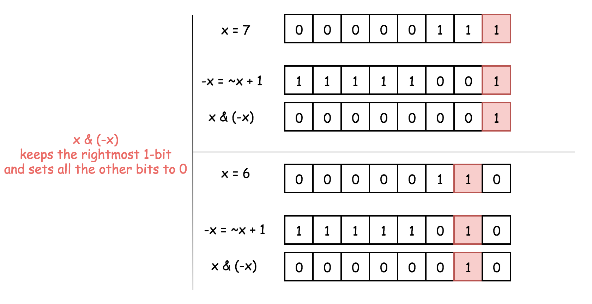

# 231. Power Of Two - Easy

Given an integer `n`, return `true` if it is a power of two. Otherwise, return `false`.

An integer `n` is a power of two, if there exists an integer `x` such that <code>n == 2<sup>x</sup></code>.

##### Example 1:

```
Input: n = 1
Output: true
Explanation: 2^0 = 1
```

##### Example 2:

```
Input: n = 16
Output: true
Explanation: 2^4 = 16
```

##### Example 3:

```
Input: n = 3
Output: false
```

##### Constraints:

- <code>-2<sup>31</sup> <= n <= 2<sup>31</sup> - 1</code>

Follow-up: Could you solve it without loops/recursion?

## Solution 1

```
# Time: O(1)
# Space: O(1)
class Solution:
    def isPowerOfTwo(self, n: int) -> bool:
        return n > 0 and n & (n - 1) == 0
```

## Notes
- Turn off the rightmost bit and check if it was the only bit in `n`. Powers of `2` only have a single `1` bit. Also notice how negative numbers cannot be a power of `2`, since `2` is positive.



## Solution 2

```
class Solution:
    def isPowerOfTwo(self, n: int) -> bool:
        return n > 0 and (n & -n) == n
```

## Notes
- Get the rightmost bit and check if it is equal to the original number.

