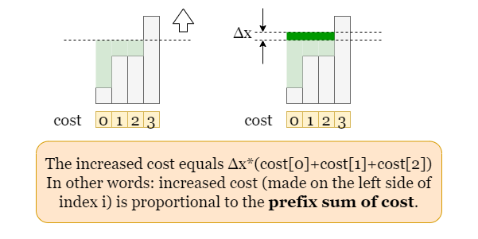

# 2448. Minimum Cost ot Make Array Equal - Hard

You are given two 0-indexed arrays `nums` and `cost` consisting each of `n` positive integers.

You can do the following operation any number of times:

- Increase or decrease any element of the array `nums` by `1`.

The cost of doing one operation on the `i`th element is `cost[i]`.

Return the minimum total cost such that all the elements of the array `nums` become equal.

##### Example 1:

```
Input: nums = [1,3,5,2], cost = [2,3,1,14]
Output: 8
Explanation: We can make all the elements equal to 2 in the following way:
- Increase the 0th element one time. The cost is 2.
- Decrease the 1st element one time. The cost is 3.
- Decrease the 2nd element three times. The cost is 1 + 1 + 1 = 3.
The total cost is 2 + 3 + 3 = 8.
It can be shown that we cannot make the array equal with a smaller cost.
```

##### Example 2:

```
Input: nums = [2,2,2,2,2], cost = [4,2,8,1,3]
Output: 0
Explanation: All the elements are already equal, so no operations are needed.
```

##### Constraints:

- <code>n == nums.length == cost.length</code>
- <code>1 <= n <= 10<sup>5</sup></code>
- <code>1 <= nums[i], cost[i] <= 10<sup>6</sup></code>

## Solution 1

```
# Time: O(nlog(n))
# Space: O(n)
class Solution:
    def minCost(self, nums: List[int], cost: List[int]) -> int:
        # brute force: test each unique val as median, O(n^2)
        # prefix cost sums to determine in linear time, using gap between curr num and prev
        pairs = sorted(list(zip(nums, cost)))
        costpre = []
        for i, (num, cost) in enumerate(pairs):
            costpre.append(cost if i == 0 else cost + costpre[-1])

        totalcost, n = 0, len(nums)
        mednum, medcost = pairs[0]
        for i in range(1, n):
            num, cost = pairs[i]
            totalcost += (num - mednum) * cost

        result = totalcost
        for i in range(1, n):
            mednum, prevmednum = pairs[i][0], pairs[i - 1][0]
            totalcost += (mednum - prevmednum) * costpre[i - 1]
            totalcost -= (mednum - prevmednum) * (costpre[-1] - costpre[i - 1])
            result = min(result, totalcost)
        return result
```

## Notes
- The brute force solution requires checking the total cost associated with treating every value in `nums` as the target to which we adjust all other numbers, in quadratic time. We can check the total cost associated with each number if we sort and use the idea of prefix sums on costs. Because we sorted, the prefix sum array of costs (sorted by corresponding `num`), can be used to determine the cumulative cost increase associated with increasing the current weighted median to some `sorted(nums)[i]` from `sorted(nums)[i - 1]`. Similarly, the postfix sum can be used to determine the cost decrease associated with increasing the current weighted median to some `sorted(nums)[i]` from `sorted(nums)[i - 1]`. Below image helps it make sense:


## Solution 2

```
# O(nlog(n))
# O(1)
class Solution:
    def minCost(self, nums: List[int], cost: List[int]) -> int:
        n = len(nums)
        get_cost = lambda x: sum(abs(nums[i] - x) * cost[i] for i in range(n))
        result = get_cost(nums[0])
        l, r = min(nums), max(nums)
        while l <= r:
            weighted_median = (l + r) // 2
            total_cost = get_cost(weighted_median)
            total_cost_next = get_cost(weighted_median + 1)
            result = min(result, total_cost)
            if total_cost > total_cost_next:
                l = weighted_median + 1
            else:
                r = weighted_median - 1
        return result
```

## Notes
- We can use binary search to solve this problem if we realize that there is only one number in the search space `[min(nums), max(nums)]` that yields the lowest total cost. All other values will result in a larger total cost. We can just check the slope of the line on which the current potential weighted median resides to determine how to proceed during a given iteration of binary search. See below image:

