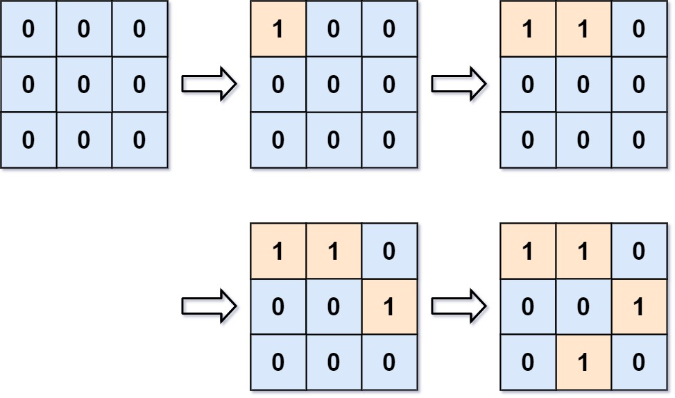

# 305. Number of Islands II - Hard

You are given an empty 2D binary grid `grid` of size `m x n`. The grid represents a map where `0`'s represent water and `1`'s represent land. Initially, all the cells of grid are water cells (i.e., all the cells are `0`'s).

We may perform an add land operation which turns the water at position into a land. You are given an array `positions` where `positions[i] = [ri, ci]` is the position `(ri, ci)` at which we should operate the `ith` operation.

Return an array of integers `answer` where `answer[i]` is the number of islands after turning the cell `(ri, ci)` into a land.

An island is surrounded by water and is formed by connecting adjacent lands horizontally or vertically. You may assume all four edges of the grid are all surrounded by water.

##### Example 1:



```
Input: m = 3, n = 3, positions = [[0,0],[0,1],[1,2],[2,1]]
Output: [1,1,2,3]
Explanation:
Initially, the 2d grid is filled with water.
- Operation #1: addLand(0, 0) turns the water at grid[0][0] into a land. We have 1 island.
- Operation #2: addLand(0, 1) turns the water at grid[0][1] into a land. We still have 1 island.
- Operation #3: addLand(1, 2) turns the water at grid[1][2] into a land. We have 2 islands.
- Operation #4: addLand(2, 1) turns the water at grid[2][1] into a land. We have 3 islands.
```

##### Example 2:

```
Input: m = 1, n = 1, positions = [[0,0]]
Output: [1]
```

##### Constraints:

- <code>1 <= m, n, positions.length <= 10<sup>4</sup></code>
- <code>1 <= m * n <= 10<sup>4</sup></code>
- `positions[i].length == 2`
- `0 <= ri < m`
- `0 <= ci < n`

Follow-up: Could you solve it in time complexity `O(k log(mn))`, where `k == positions.length`?

## Solution 1

```
class Union:
    def __init__(self, m, n):
        self.n = n
        nodes = m * n
        self.roots = [i for i in range(nodes)]
        self.sizes = [1] * nodes
    
    def find(self, i, j):
        node = i * self.n + j
        path = []
        while self.roots[node] != node:
            path.append(node)
            node = self.roots[node]
        root = node
        for node in path:
            self.roots[node] = root
            self.sizes[node] = self.sizes[root]
        return root
    
    def union(self, i1, j1, i2, j2):
        root1 = self.find(i1, j1)
        root2 = self.find(i2, j2)
        if root1 == root2:
            return False
        
        if self.sizes[root1] < self.sizes[root2]:
            self.sizes[root2] += self.sizes[root1]
            self.roots[root1] = root2
        else:
            self.sizes[root1] += self.sizes[root2]
            self.roots[root2] = root1
        return True

# Time: O(mn + k)
# Space: O(mn + k)
class Solution:
    def numIslands2(self, m: int, n: int, positions: List[List[int]]) -> List[int]:
        u = Union(m, n)
        diffs = ((0, -1), (0, 1), (-1, 0), (1, 0))
        inbounds = lambda i, j: 0 <= i < m and 0 <= j < n
        lands, result = set(), []
        for i, j in positions:
            if (i, j) in lands:
                result.append(result[-1])
                continue
            unioned = 0
            for di, dj in diffs:
                i2, j2 = i + di, j + dj
                if not inbounds(i2, j2) or (i2, j2) not in lands:
                    continue
                if u.union(i, j, i2, j2):
                    unioned += 1
                    
            lands.add((i, j))
            islands = 0 if not result else result[-1]
            if unioned == 0:
                islands += 1
            else:
                islands = result[-1] - (unioned - 1)
            result.append(islands)
                
        return result
```

## Notes
- Note the `Union` data structure has path compression and rank/size implemented, so calls to `union` and `find` are upper bounded by the ackerman function passed `nodes`. This means `union` calls from the main function can be considered as taking constant time. Also note how the number of successful union operations relates to the number of islands present after each operations. This relation and realizing this is a Union Find problem is the crux of the problem.

## Solution 2

```
class Union:
    def __init__(self, m, n):
        self.n = n
        self.roots = {}
        
    def cellid(self, i, j):
        return i * self.n + j
    
    def find(self, i, j):
        cid = self.cellid(i, j)
        if cid not in self.roots:
            self.roots[cid] = [cid, 1]
            return self.roots[cid]
        
        curr, path = cid, []
        while self.roots[curr][0] != curr:
            path.append(curr)
            curr = self.roots[curr][0]
        root, size = self.roots[curr]
        for node in path:
            self.roots[node][0], self.roots[node][1] = root, size
        return root, size
    
    def union(self, i1, j1, i2, j2):
        root1, size1 = self.find(i1, j1)
        root2, size2 = self.find(i2, j2)
        if root1 == root2:
            return False
        if size1 < size2:
            self.roots[root2][1] += self.roots[root1][1]
            self.roots[root1][0], self.roots[root1][1] = root2, self.roots[root2][1]
        else:
            self.roots[root1][1] += self.roots[root2][1]
            self.roots[root2][0], self.roots[root2][1] = root1, self.roots[root1][1]
        return True
            

# Time: O(k)
# Space: O(k)
class Solution:
    def numIslands2(self, m: int, n: int, positions: List[List[int]]) -> List[int]:
        u = Union(m, n)
        diffs = ((0, -1), (0, 1), (-1, 0), (1, 0))
        inbounds = lambda i, j: 0 <= i < m and 0 <= j < n
        lands, result = set(), []
        for i, j in positions:
            if (i, j) in lands:
                result.append(result[-1])
                continue
            unioned = 0
            for di, dj in diffs:
                i2, j2 = i + di, j + dj
                if not inbounds(i2, j2) or (i2, j2) not in lands:
                    continue
                if u.union(i, j, i2, j2):
                    unioned += 1
                    
            lands.add((i, j))
            islands = 0 if not result else result[-1]
            if unioned == 0:
                islands += 1
            else:
                islands = result[-1] - (unioned - 1)
            result.append(islands)
                
        return result
```

## Notes
- Can be more efficient with the `Union` data structure by utilizing hash table instead of array to store root pointers, avoiding a full `O(mn)` initialization.