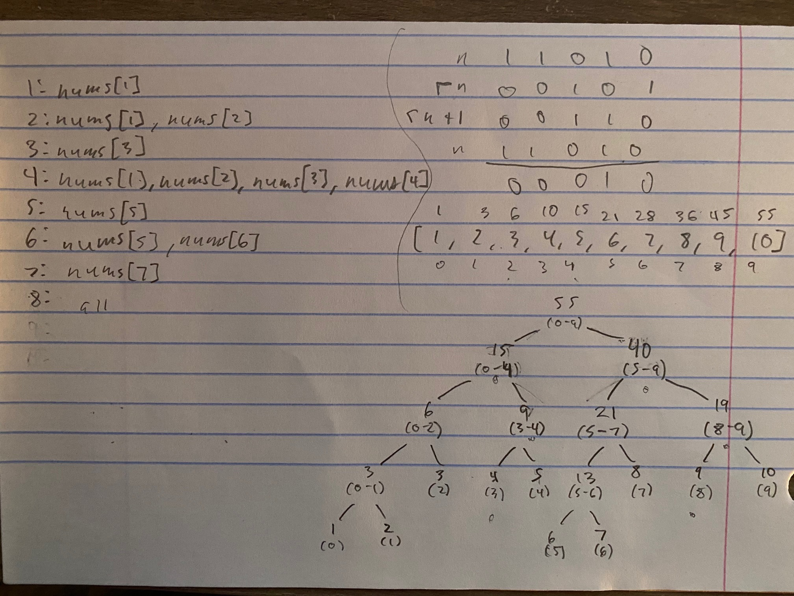

# 307. Range Sum Query - Mutable - Medium

Given an integer array `nums`, handle multiple queries of the following types:

- Update the value of an element in `nums`.
- Calculate the sum of the elements of `nums` between indices `left` and `right` inclusive where `left <= right`.

Implement the `NumArray` class:

- `NumArray(int[] nums)` Initializes the object with the integer array `nums`.
- `void update(int index, int val)` Updates the value of `nums[index]` to be `val`.
- `int sumRange(int left, int right)` Returns the sum of the elements of `nums` between indices `left` and `right` inclusive (i.e. `nums[left] + nums[left + 1] + ... + nums[right]`).


##### Example 1:

```
Input
["NumArray", "sumRange", "update", "sumRange"]
[[[1, 3, 5]], [0, 2], [1, 2], [0, 2]]
Output
[null, 9, null, 8]

Explanation
NumArray numArray = new NumArray([1, 3, 5]);
numArray.sumRange(0, 2); // return 1 + 3 + 5 = 9
numArray.update(1, 2);   // nums = [1, 2, 5]
numArray.sumRange(0, 2); // return 1 + 2 + 5 = 8
```

##### Constraints:

- <code>1 <= nums.length <= 3 * 10<sup>4</sup></code>
- `-100 <= nums[i] <= 100`
- `0 <= index < nums.length`
- `-100 <= val <= 100`
- `0 <= left <= right < nums.length`
- At most <code>3 * 10<sup>4</sup></code> calls will be made to `update` and `sumRange`.

## Solution 1

```
# Time: O(n) for init, O(sqrt(n)) for sumRange, O(1) for update
# Space: O(sqrt(n)) if nums is only stored in instance as ref else O(n)
class NumArray:
    def __init__(self, nums: List[int]):
        self.nums = nums
        n = len(nums)
        self.sq = int(n ** 0.5) + 1
        self.subs = [0 for _ in range(self.sq)]
        for i, v in enumerate(nums):
            k = i // self.sq
            self.subs[k] += v

    def update(self, index: int, val: int) -> None:
        diff = val - self.nums[index]
        self.nums[index] += diff
        self.subs[index // self.sq] += diff

    def sumRange(self, left: int, right: int) -> int:
        result = 0
        sqstart = left // self.sq + 1
        sqstop = right // self.sq
        if sqstart > sqstop:
            result += sum(self.nums[left:right + 1])
            return result
        
        for i in range(sqstart, sqstop):
            result += self.subs[i]
        for i in range(left, self.sq * sqstart):
            result += self.nums[i]
        for i in range(self.sq * sqstop, right + 1):
            result += self.nums[i]
        return result
```

## Notes
- Most straightforward of the solutions to this problem, bucket subarray sections of size proportional to the square root of the length into sums such that for large range queries we can add mostly buckets and then do small linear scans for the head and tail regions of the range that do not fall cleanly into the square root sections. Note how traversal of all buckets is `O(sqrt(n))`, and traversal of the contents of a bucket is also `O(sqrt(n))`.

## Solution 2

```
class Node:
    def __init__(self, sum, range):
        self.sum = sum
        self.range = range
        self.isleaf = range[0] == range[1]

class SegmentTree:
    def __init__(self, nums):
        self.root = self.buildtree(0, len(nums) - 1, nums)
        
    def buildtree(self, i, j, nums):
        if i == j:
            return Node(nums[i], (i, j))
        
        mid = (i + j) // 2
        left = self.buildtree(i, mid, nums)
        right = self.buildtree(mid + 1, j, nums)
        root = Node(left.sum + right.sum, (i, j))
        root.left, root.right = left, right
        
        return root
    
    def update(self, i, val):
        def rec(node):
            if node.isleaf:
                diff = val - node.sum
                node.sum = val
                return diff
            
            k, l = node.range
            mid = (k + l) // 2
            diff = rec(node.left) if i <= mid else rec(node.right)
            node.sum += diff
            return diff
        
        rec(self.root)
    
    def query(self, i, j):
        def rec(node, i, j):
            k, l = node.range
            if i == k and j == l:
                return node.sum
            
            mid = (k + l) // 2
            if j <= mid:
                return rec(node.left, i, j)
            if i >= mid + 1:
                return rec(node.right, i, j)
            
            return rec(node.left, i, mid) + rec(node.right, mid + 1, j)
        
        return rec(self.root, i, j)
    
# Time: O(n) init, O(log(n)) update + query
# Space: O(n) overall
class NumArray:
    def __init__(self, nums: List[int]):
        self.tree = SegmentTree(nums)

    def update(self, index: int, val: int) -> None:
        self.tree.update(index, val)

    def sumRange(self, left: int, right: int) -> int:
        return self.tree.query(left, right)
```

## Notes
- Recursive segment tree implementation that is much more intuitive than the iterative version, not a super common data structure to use so will not bother with iterative. See image below for example of a segment tree, as well as an example of BIT, which is my preferred data structure for range query problems and is used for the third solution. The image to the upper left represents the elements whose sum is stored at a particular index in a BIT, and the bottom right image shows a segment tree constructed for querying range sums of the array just above it.



## Solution 3

```
class BIT:
    def __init__(self, nums):
        self.n = len(nums)
        self.nums = nums
        self.tree = [0] * (self.n + 1)
        for i, num in enumerate(nums):
            k = i + 1
            while k <= self.n:
                self.tree[k] += num
                k += self.rmb(k)
    
    def rmb(self, num):
        return num & (~num + 1)
    
    def update(self, i, val):
        diff = val - self.nums[i]
        self.nums[i] += diff
        k = i + 1
        while k <= self.n:
            self.tree[k] += diff
            k += self.rmb(k)
    
    def query(self, i, j):
        k = j + 1
        result = 0
        while k:
            result += self.tree[k]
            k -= self.rmb(k)
        k = i
        while k:
            result -= self.tree[k]
            k -= self.rmb(k)
        
        return result

# Time: O(nlog(n)) init, O(log(n)) update, O(log(n)) query
class NumArray:
    def __init__(self, nums: List[int]):
        self.bit = BIT(nums)

    def update(self, index: int, val: int) -> None:
        self.bit.update(index, val)

    def sumRange(self, left: int, right: int) -> int:
        return self.bit.query(left, right)
```

## Notes
- BIT or binary index tree works by storing particular non-overlapping partial sums at 1-indices in the underlying array that represents the tree, based on bitshifting. It seems magical to me still, and the original paper on it by Fenwick (BIT are AKA Fenwick trees) that I am sure would demystify it I haven't read. In short, an element at a particular 1-index will be added to the each in bounds tree array index that is in the series `a, a + rightmostbit(a), a + rightmostbit(a) + rightmostbit(rightmostbit(a) + a), ...`. This logic is used to build the tree and update it, and it is used in reverse to query the tree. There are also implementations of BIT that build the initial tree in linear time but will leave as is because this version makes understanding core logic easier.