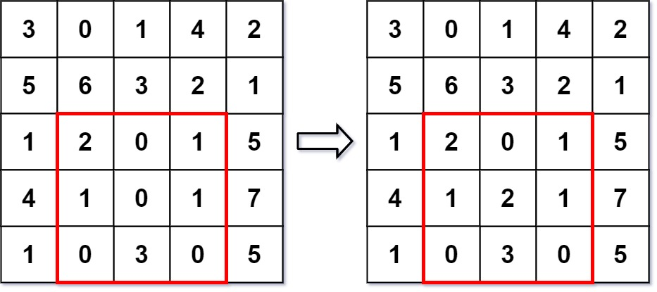
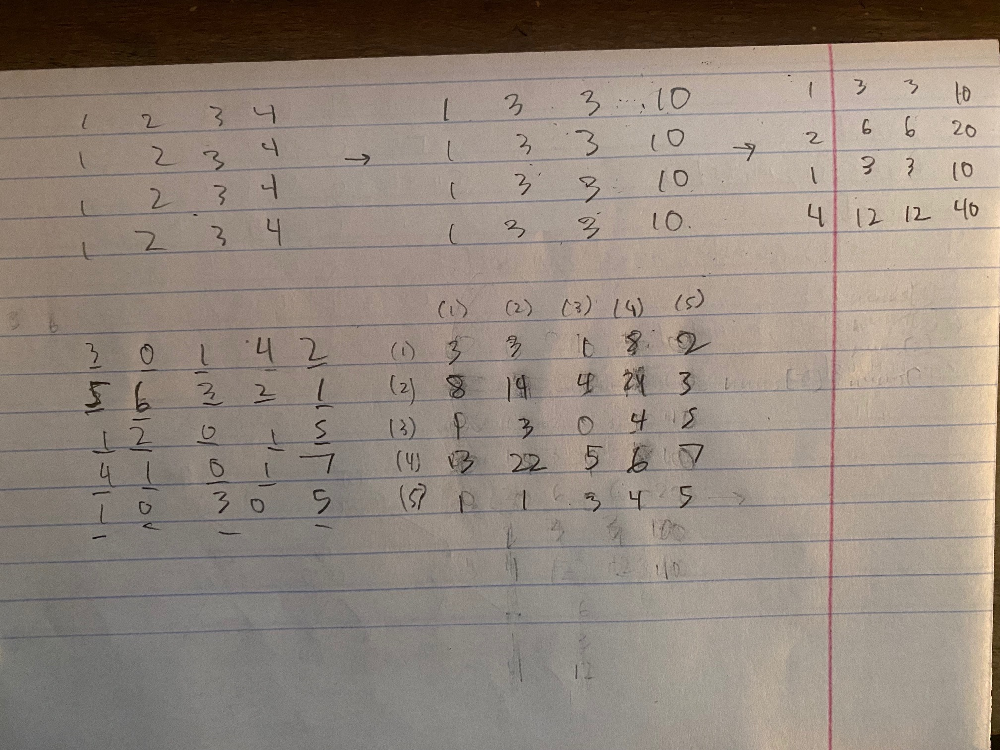

# 308. Range Sum Query 2D - Mutable - Hard

Given a 2D matrix `matrix`, handle multiple queries of the following types:

1. Update the value of a cell in `matrix`.
1. Calculate the sum of the elements of matrix inside the rectangle defined by its upper left corner `(row1, col1)` and lower right corner `(row2, col2)`.

Implement the `NumMatrix` class:

- `NumMatrix(int[][] matrix)` Initializes the object with the integer matrix `matrix`.
- `void update(int row, int col, int val)` Updates the value of `matrix[row][col]` to be `val`.
- `int sumRegion(int row1, int col1, int row2, int col2)` Returns the sum of the elements of matrix inside the rectangle defined by its upper left corner `(row1, col1)` and lower right corner `(row2, col2)`.


##### Example 1:



```
Input
["NumMatrix", "sumRegion", "update", "sumRegion"]
[[[[3, 0, 1, 4, 2], [5, 6, 3, 2, 1], [1, 2, 0, 1, 5], [4, 1, 0, 1, 7], [1, 0, 3, 0, 5]]], [2, 1, 4, 3], [3, 2, 2], [2, 1, 4, 3]]
Output
[null, 8, null, 10]

Explanation
NumMatrix numMatrix = new NumMatrix([[3, 0, 1, 4, 2], [5, 6, 3, 2, 1], [1, 2, 0, 1, 5], [4, 1, 0, 1, 7], [1, 0, 3, 0, 5]]);
numMatrix.sumRegion(2, 1, 4, 3); // return 8 (i.e. sum of the left red rectangle)
numMatrix.update(3, 2, 2);       // matrix changes from left image to right image
numMatrix.sumRegion(2, 1, 4, 3); // return 10 (i.e. sum of the right red rectangle)
```

##### Constraints:

- `m == matrix.length`
- `n == matrix[i].length`
- `1 <= m, n <= 200`
- `0 <= row < m`
- `0 <= col < n`
- <code>-10<sup>5</sup> <= matrix[i][j] <= 10<sup>5</sup></code>
- <code>-10<sup>5</sup> <= val <= 10<sup>5</sup></code>
- `0 <= row1 <= row2 < m`
- `0 <= col1 <= col2 < n`
- At most <code>10<sup>4</sup></code> calls will be made to `sumRegion` and `update`.

## Solution

```
class BIT2D:
    def __init__(self, matrix):
        self.m, self.n = len(matrix), len(matrix[0])
        self.matrix = matrix
        self.bit = [[0] * (self.n + 1) for _ in range(self.m + 1)]
        for i in range(self.m):
            for j in range(self.n):
                self.update(i, j, self.matrix[i][j], True)
        
    def query(self, i, j):
        ki, kj = i + 1, j + 1
        result = 0
        while ki:
            while kj:
                result += self.bit[ki][kj]
                kj -= self.rmb(kj)
            kj = j + 1
            ki -= self.rmb(ki)
        return result
    
    def rmb(self, num):
        return num & (~num + 1)
    
    def update(self, i, j, val, init=False):
        diff = val - self.matrix[i][j] if not init else val
        if not init:
            self.matrix[i][j] += diff
        ki, kj = i + 1, j + 1
        while ki <= self.m:
            while kj <= self.n:
                self.bit[ki][kj] += diff
                kj += self.rmb(kj)
            kj = j + 1
            ki += self.rmb(ki)

# Time: O(m * log(m) * n * log(n)) init, O(log(m) * log(n)) query + update
# Space: O(mn)
class NumMatrix:
    def __init__(self, matrix: List[List[int]]):
        self.bit2d = BIT2D(matrix)

    def update(self, row: int, col: int, val: int) -> None:
        self.bit2d.update(row, col, val)

    def sumRegion(self, row1: int, col1: int, row2: int, col2: int) -> int:
        top = self.bit2d.query(row1 - 1, col2) if row1 > 0 else 0
        left = self.bit2d.query(row2, col1 - 1) if col1 > 0 else 0
        topleft = self.bit2d.query(row1 - 1, col1 - 1) if col1 > 0 and row1 > 0 else 0
        total = self.bit2d.query(row2, col2)
        return total - top - left + topleft
```

## Notes
- We extend the idea of BIT to 2 dimensions, can be difficult to see how the extension works for newer algo people. For me it helps to consider the 2d bit matrix as a collection of 1d BITs. We can make all the 1d BITs store information about the 2d matrix by treating the columns of the lined up 1d BITs as their own 1d BITs, but vertical. See image below, particularly top example.
