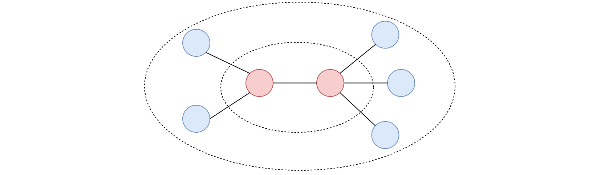

# 310. Minimum Height Trees - Medium

A tree is an undirected graph in which any two vertices are connected by exactly one path. In other words, any connected graph without simple cycles is a tree.

Given a tree of `n` nodes labelled from `0` to `n - 1`, and an array of `n - 1` edges where `edges[i] = [ai, bi]` indicates that there is an undirected edge between the two nodes `ai` and `bi` in the tree, you can choose any node of the tree as the root. When you select a node `x` as the root, the result tree has height `h`. Among all possible rooted trees, those with minimum height (i.e. `min(h)`)  are called minimum height trees (MHTs).

Return a list of all MHTs' root labels. You can return the answer in any order.

The height of a rooted tree is the number of edges on the longest downward path between the root and a leaf.

##### Example 1:

```
Input: n = 4, edges = [[1,0],[1,2],[1,3]]
Output: [1]
Explanation: As shown, the height of the tree is 1 when the root is the node with label 1 which is the only MHT.
```

##### Example 2:

```
Input: n = 6, edges = [[3,0],[3,1],[3,2],[3,4],[5,4]]
Output: [3,4]
```

##### Constraints:

- <code>1 <= n <= 2 * 10<sup>4</sup></code>
- `edges.length == n - 1`
- `0 <= ai, bi < n`
- `ai != bi`
- All the pairs `(ai, bi)` are distinct.
- The given input is guaranteed to be a tree and there will be no repeated edges.

## Solution 1

```
# Time: O(v + e)
# Space: O(v + e)
class Solution:
    def findMinHeightTrees(self, n: int, edges: List[List[int]]) -> List[int]:
        g = defaultdict(list)
        for a, b in edges:
            g[a].append(b)
            g[b].append(a)
            
        result1 = set()
        result2 = set()
        def bfs(root, t1, t2, a=False):
            q = deque([(root, 0)])
            seen, ff = set(), (root, 0)
            while q:
                curr, d = q.pop()
                if curr in seen:
                    continue
                    
                seen.add(curr)
                if d == t1:
                    if a:
                        result1.add(curr)
                    else:
                        result2.add(curr)
                if d == t2:
                    if a:
                        result1.add(curr)
                    else:
                        result2.add(curr)
                if d > ff[1]:
                    ff = (curr, d)
                for neighbor in g[curr]:
                    if neighbor not in seen:
                        q.append((neighbor, d + 1))
            return ff
        
        a, _ = bfs(0, None, None)
        b, dist = bfs(a, None, None)
        d1 = dist // 2
        d2 = dist // 2 + 1 if dist & 1 else None
        bfs(a, d1, d2, True)
        bfs(b, d1, d2)
        return list(result1 & result2)
```

## Notes
- This solution works by finding the distance between the most distant nodes in the graph, which can be used to calculate the midpoint node(s) distance from these distant nodes. The MHT root will always split as evenly as possible the distance between the most distant nodes in the tree. We need to be careful with this approach, however, because there can be non-MHT root nodes that are the midpoint distance away from the most distant nodes. We can handle this case by performing bfs/dfs for the midpoint distance nodes from each of the most distant nodes, and then returning the union of the results of both of those calls. 
- Note this solution could be optimized by prematurely terminating our search once there are no more nodes in the queue that have distance `>=` the target distance, which is not part of the above solution but could be added, though more easily with dfs.

## Solution 2

```
# Time: O(v + e)
# Space: O(v + e)
class Solution:
    def findMinHeightTrees(self, n: int, edges: List[List[int]]) -> List[int]:
        if n == 1:
            return [0]
        g = defaultdict(set)
        indegree = defaultdict(int)
        for a, b in edges:
            g[a].add(b)
            g[b].add(a)
            indegree[a] += 1
            indegree[b] += 1
        
        prev = [node for node, i in indegree.items() if i == 1]
        while n > 2:
            curr = []
            for node in prev:
                n -= 1
                indegree[node] = 0
                for neighbor in g[node]:
                    if indegree[neighbor] > 1:
                        indegree[neighbor] -= 1
                        if indegree[neighbor] == 1:
                            curr.append(neighbor)
            prev = curr
        
        return prev
```

## Notes
- We can approach this problem in a top sort manner, where we keep eliminating the next layer of perimeter until there are less than `3` nodes that haven't been visited yet. The `3` comes from the fact that there will only ever be `1` "centroid" in a tree with an odd number of nodes, and there will only ever be `2` "centroids" in a tree with an even number of nodes. See below image.

