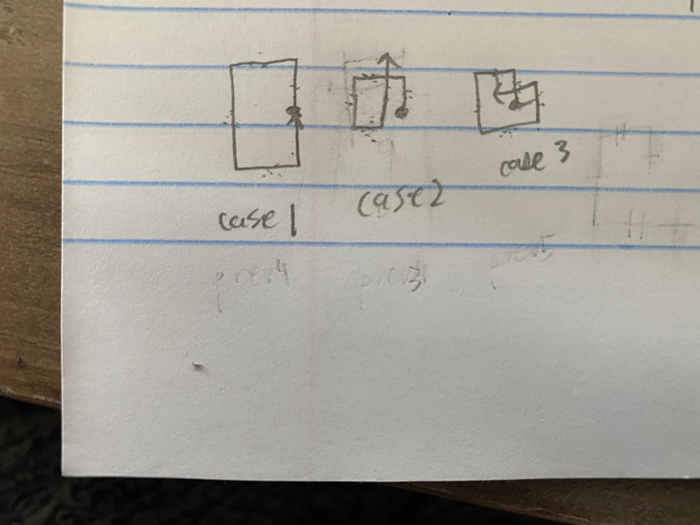

# 335. Self Crossing - Hard

You are given an array of integers `distance`.

You start at point `(0,0)` on an X-Y plane and you move `distance[0]` meters to the north, then `distance[1]` meters to the west, `distance[2]` meters to the south, `distance[3]` meters to the east, and so on. In other words, after each move, your direction changes counter-clockwise.

Return `true` if your path crosses itself, and `false` if it does not.

##### Example 1:

```
Input: distance = [2,1,1,2]
Output: true
```

##### Example 2:

```
Input: distance = [1,2,3,4]
Output: false
```

##### Example 3:

```
Input: distance = [1,1,1,1]
Output: true
```

##### Constraints:

- <code>1 <= distance.length <= 10<sup>5</sup></code>
- <code>1 <= distance[i] <= 10<sup>5</sup></code>

## Solution

```
# Time: O(n)
# Space: O(1)
class Solution:
    def isSelfCrossing(self, distance: List[int]) -> bool:
        prev1 = prev2 = prev3 = prev4 = prev5 = 0
        for i, d in enumerate(distance):
            if i >= 3:
                if prev1 == prev3 and prev2 <= d + prev4:
                    return True
                if prev1 < prev3 and prev2 <= d:
                    return True
                if prev1 <= prev3 and prev2 >= prev4 and d >= prev2 - prev4 and prev1 >= prev3 - prev5:
                    return True
            prev1, prev2, prev3, prev4, prev5 = d, prev1, prev2, prev3, prev4
        return False
```

## Notes
- Main idea to solve this naively is to try and enumerate all the ways an edge could cross a previous edge. Well, an up edge could cross a left edge, a right edge, or a previous up edge. Similarly, a left edge could cross an up edge, a down edge, or a right edge. A down edge could cross a left edge, a right edge, or an up edge. Last, a right edge could cross an up edge, a down edge, or a left edge. 
- In my more naive attempts to solve this problem, I tried to enumerate all of these cases for each direction left, right, up, down, which was very code-heavy and tedious and involved keeping track of information about the previous `2` up lines, the previous `2` down lines, the previous `2` left lines, and the previous `2` right lines. The above approach is based on Stefan Pochmann solution and takes advantage of the fact that the direction of the line does not matter; any intersections that happen fundamentally occur because of the `3` cases shown in the below image: we either close the outer edge of a spiral to form a circle, we intersect an interior edge inside a contracting spiral, or we intersect an exterior edge in an expanding spiral. In other words, instead of considering unique cases for if the current line faces up, down, left, or right, treat all lines as if they are going up by rotating our x-y plane; this cuts down on the complexity of the problem significantly.
