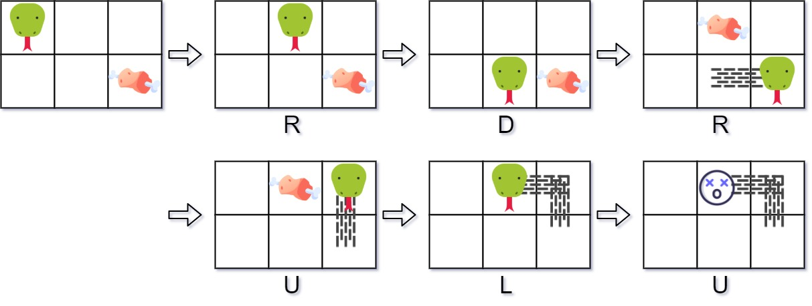

# 353. Design Snake Game - Medium

Design a Snake game that is played on a device with screen size `height x width`. Play the game online if you are not familiar with the game.

The snake is initially positioned at the top left corner `(0, 0)` with a length of `1` unit.

You are given an array food where `food[i] = (ri, ci)` is the row and column position of a piece of food that the snake can eat. When a snake eats a piece of food, its length and the game's score both increase by `1`.

Each piece of food appears one by one on the screen, meaning the second piece of food will not appear until the snake eats the first piece of food.

When a piece of food appears on the screen, it is guaranteed that it will not appear on a block occupied by the snake.

The game is over if the snake goes out of bounds (hits a wall) or if its head occupies a space that its body occupies after moving (i.e. a snake of length 4 cannot run into itself).

Implement the `SnakeGame` class:

- `SnakeGame(int width, int height, int[][] food)` Initializes the object with a screen of size `height x width` and the positions of the `food`.
- `int move(String direction)` Returns the score of the game after applying one `direction` move by the snake. If the game is over, return `-1`.


##### Example 1:



```
Input
["SnakeGame", "move", "move", "move", "move", "move", "move"]
[[3, 2, [[1, 2], [0, 1]]], ["R"], ["D"], ["R"], ["U"], ["L"], ["U"]]
Output
[null, 0, 0, 1, 1, 2, -1]

Explanation
SnakeGame snakeGame = new SnakeGame(3, 2, [[1, 2], [0, 1]]);
snakeGame.move("R"); // return 0
snakeGame.move("D"); // return 0
snakeGame.move("R"); // return 1, snake eats the first piece of food. The second piece of food appears at (0, 1).
snakeGame.move("U"); // return 1
snakeGame.move("L"); // return 2, snake eats the second food. No more food appears.
snakeGame.move("U"); // return -1, game over because snake collides with border
```

##### Constraints:

- <code>1 <= width, height <= 10<sup>4</sup></code>
- `1 <= food.length <= 50`
- `food[i].length == 2`
- `0 <= ri < height`
- `0 <= ci < width`
- `direction.length == 1`
- `direction` is `'U'`, `'D'`, `'L'`, or `'R'`.
- At most <code>10<sup>4</sup></code> calls will be made to move.

## Solution

```
# Overall Space: O(n + m)
class SnakeGame:
    # Time: O(1)
    def __init__(self, width: int, height: int, food: List[List[int]]):
        self.bodyq = deque([(0, 0)])
        self.bodyset = set([(0, 0)])
        self.k = 0
        self.m, self.n = height, width
        self.f = len(food)
        self.food = food

    UP, RIGHT, DOWN, LEFT = 0, 1, 2, 3
    DIFFS = ((-1, 0), (0, 1), (1, 0), (0, -1))
    inbounds = lambda self, i, j: 0 <= i < self.m and 0 <= j < self.n
    
    # Time: O(1)
    def move(self, direction: str) -> int:
        di = dj = None
        if direction == "U":
            di, dj = self.DIFFS[self.UP]
        elif direction == "D":
            di, dj = self.DIFFS[self.DOWN]
        elif direction == "L":
            di, dj = self.DIFFS[self.LEFT]
        else:
            di, dj = self.DIFFS[self.RIGHT]
        
        i, j = self.bodyq[0]
        popped = self.bodyq.pop()
        self.bodyset.remove(popped)
        newhead = (i + di, j + dj)
        self.bodyq.appendleft(newhead)
        self.bodyset.add(newhead)
        i, j = newhead
        if not self.inbounds(i, j) or len(self.bodyset) < len(self.bodyq):
            return -1
        
        fi = None if self.k == self.f else self.food[self.k][0]
        fj = None if self.k == self.f else self.food[self.k][1]
        if fi == i and fj == j:
            self.bodyq.append(popped)
            self.bodyset.add(popped)
            self.k += 1
        
        return len(self.bodyq) - 1
```

## Notes
- The key thing to realize with snake game is how the snake moves; each body cell follows the one before it as the snake moves. This is perfectly handled with a double ended queue, where each time the snake moves we `appendleft` the new head position and `popright` (just `pop` in python) the old tail position. If the snake ate food on this particular move, we can reattach it in the old tail position with `append`. To handle case where snake runs into itself, we can use a set to keep track of all body positions, and if we ever double add a position after a move has been executed, i.e. the snake has run into itself, the body set will be one smaller than the body queue, so we can check for this and return `-1` if it ever happens.