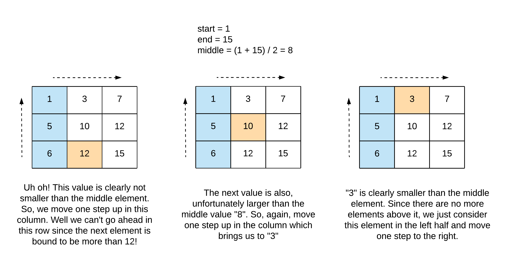

# 378. Kth Smallest in a Sorted Matrix - Medium

Given an `n x n` matrix where each of the rows and columns is sorted in ascending order, return the `kth` smallest element in the matrix.

Note that it is the `kth` smallest element in the sorted order, not the `kth` distinct element.

You must find a solution with a memory complexity better than <code>O(n<sup>2</sup>)</code>.

##### Example 1:

```
Input: matrix = [[1,5,9],[10,11,13],[12,13,15]], k = 8
Output: 13
Explanation: The elements in the matrix are [1,5,9,10,11,12,13,13,15], and the 8th smallest number is 13
```

##### Example 2:

```
Input: matrix = [[-5]], k = 1
Output: -5
```

##### Constraints:

- <code>n == matrix.length == matrix[i].length</code>
- <code>1 <= n <= 300</code>
- <code>-10<sup>9</sup> <= matrix[i][j] <= 10<sup>9</sup></code>
- <code>1 <= k <= n<sup>2</sup></code>
- All the rows and columns of `matrix` are guaranteed to be sorted in non-decreasing order.

Follow-up: 

- Could you solve the problem with a constant memory (i.e., `O(1)` memory complexity)?
- Could you solve the problem in `O(n)` time complexity? The solution may be too advanced for an interview but you may find reading this paper fun.


## Solution 1

```
import heapq

# Time: O(k * log(n))
# Space: O(n)
class Solution:
    def kthSmallest(self, matrix: List[List[int]], k: int) -> int:
        h = [(row[0], i, 0) for i, row in enumerate(matrix)]
        n = len(matrix)
        heapq.heapify(h)
        for i in range(k - 1):
            ithsmallest, i, j = heapq.heappop(h)
            if j < n - 1:
                heapq.heappush(h, (matrix[i][j + 1], i, j + 1))

        return heapq.heappop(h)[0]
```

## Notes
- When we hear kth smallest or kth largest, __we should always try to apply heap or quickselect__, even if, as in this problem, it seems like there is a better alternative based on some clues in the problem.
- We can treat this as a restatement of Merge K Sorted Lists, but instead of merging the lists into one sorted list with a heap we want to just use the heap to order the elements of all the sorted rows, and get the kth 1-indexed element of the would-be sorted merged list. If this problem was stated differently it would be simple to come up with this idea if you have done the Merge K Sorted Lists problem before, but the way they mention columns being sorted as well makes it seem like we should be able to do this in linear time with some sort of traversal technique.
- This technique is useful for any problem where we have multiple sorted sequences and want to determine the overall order of the merged sequences. 
- There is a binary search solution as well that uses `[matrix[0][0], matrix[-1][-1]]` as the search space; time complexity is `O(nlog(r))` for this solution and uses constant space, addressing the followup. For a `mid` in binary search, we can determine the number of elements in `matrix` that are less than it by traversing the `matrix` in `O(n)` time. So we binary search for the `mid` that is in `matrix` and has `k - 1` `matrix` elements smaller than it. See diagram below detailing `O(n)` traversal process for determining number of `matrix` elements smaller than the current `mid`.
