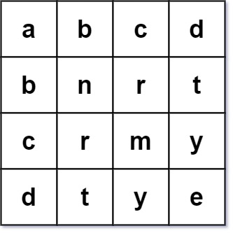

# 422. Valid Word Square - Easy

Given an array of strings `words`, return `true` if it forms a valid word square.

A sequence of strings forms a valid word square if the `kth` row and column read the same string, where `0 <= k < max(numRows, numColumns)`.

##### Example 1:



```
Input: words = ["abcd","bnrt","crmy","dtye"]
Output: true
Explanation:
The 1st row and 1st column both read "abcd".
The 2nd row and 2nd column both read "bnrt".
The 3rd row and 3rd column both read "crmy".
The 4th row and 4th column both read "dtye".
Therefore, it is a valid word square.
```

##### Example 2:

```
Input: words = ["abcd","bnrt","crm","dt"]
Output: true
Explanation:
The 1st row and 1st column both read "abcd".
The 2nd row and 2nd column both read "bnrt".
The 3rd row and 3rd column both read "crm".
The 4th row and 4th column both read "dt".
Therefore, it is a valid word square.
```

##### Example 3:

```
Input: words = ["ball","area","read","lady"]
Output: false
Explanation:
The 3rd row reads "read" while the 3rd column reads "lead".
Therefore, it is NOT a valid word square.
```

##### Constraints:

- `1 <= words.length <= 500`
- `1 <= words[i].length <= 500`
- `words[i]` consists of only lowercase English letters.

## Solution

```
# Time: O(mn)
# Space: O(1)
class Solution:
    def validWordSquare(self, words: List[str]) -> bool:
        m, n = len(words), len(words[0])
        if m != n or not all(len(w) <= n for w in words):
            return False
        for i in range(m):
            top = words[i]
            for j in range(i, n):
                tl = top[j] if j < len(top) else None
                bl = words[j][i] if j < m and i < len(words[j]) else None
                if tl != bl:
                    return False
        return True
```

## Notes
- Here I have literally translated the requirements of the prompt to code to solve the problem, but we are being asked to determine if the transposition of the matrix (flipping about a diagonal) is equal to itself. A much terser solution would use python's `zip_longest` to handle this in one line.