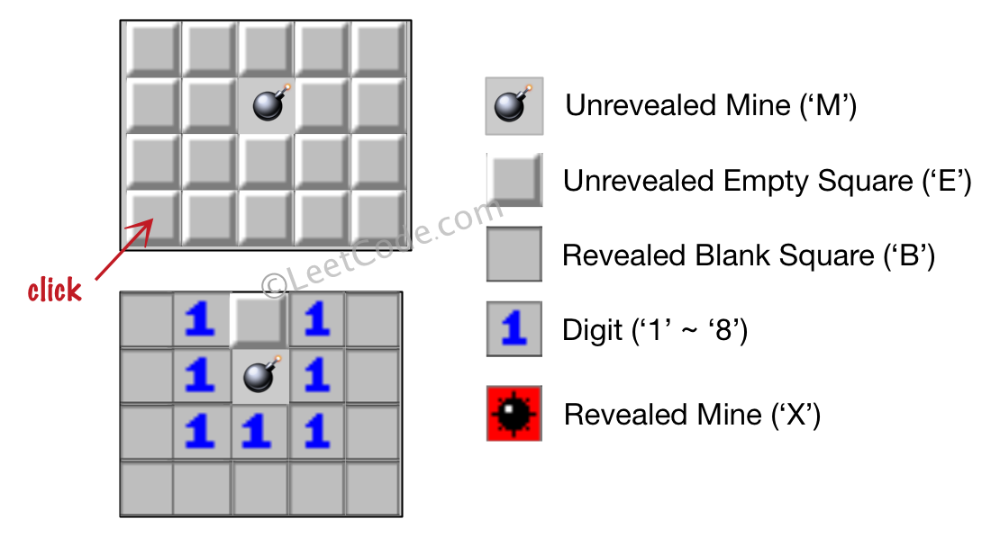

# 529. Minesweeper - Medium

Let's play the minesweeper game!

You are given an `m x n` char matrix `board` representing the game board where:

- `'M'` represents an unrevealed mine,
- `'E'` represents an unrevealed empty square,
- `'B'` represents a revealed blank square that has no adjacent mines (i.e., above, below, left, right, and all 4 diagonals),
- digit (`'1'` to `'8'`) represents how many mines are adjacent to this revealed square, and
- `'X'` represents a revealed mine.

You are also given an integer array `click` where `click = [clickr, clickc]` represents the next click position among all the unrevealed squares (`'M'` or `'E'`).

Return the board after revealing this position according to the following rules:

- If a mine `'M'` is revealed, then the game is over. You should change it to `'X'`.
- If an empty square `'E'` with no adjacent mines is revealed, then change it to a revealed blank `'B'` and all of its adjacent unrevealed squares should be revealed recursively.
- If an empty square `'E'` with at least one adjacent mine is revealed, then change it to a digit (`'1'` to `'8'`) representing the number of adjacent mines.
    Return the board when no more squares will be revealed.


##### Example 1:



```
Input: board = [["E","E","E","E","E"],["E","E","M","E","E"],["E","E","E","E","E"],["E","E","E","E","E"]], click = [3,0]
Output: [["B","1","E","1","B"],["B","1","M","1","B"],["B","1","1","1","B"],["B","B","B","B","B"]]
```

##### Example 2:


```
Input: board = [["B","1","E","1","B"],["B","1","M","1","B"],["B","1","1","1","B"],["B","B","B","B","B"]], click = [1,2]
Output: [["B","1","E","1","B"],["B","1","X","1","B"],["B","1","1","1","B"],["B","B","B","B","B"]]
```

##### Constraints:

- `m == board.length`
- `n == board[i].length`
- `1 <= m, n <= 50`
- `board[i][j]` is either `'M'`, `'E'`, `'B'`, or a digit from `'1'` to `'8'`.
- `click.length == 2`
- `0 <= clickr < m`
- `0 <= clickc < n`
- `board[clickr][clickc]` is either `'M'` or `'E'`.

## Solution

```
from collections import deque

# Time: O(mn)
# Space: O(mn)
class Solution:
    def updateBoard(self, board: List[List[str]], click: List[int]) -> List[List[str]]:
        i, j = click
        if board[i][j] == 'M':
            board[i][j] = 'X'
            return board

        m, n = len(board), len(board[0])
        diffs = ((0, -1), (0, 1), (-1, 0), (1, 0), (-1, 1), (-1, -1), (1, -1), (1, 1))
        inbounds = lambda i, j: 0 <= i < m and 0 <= j < n
        seen, q = set(), deque([(i, j)])
        while q:
            i, j = q.popleft()
            if (i, j) in seen:
                continue
            seen.add((i, j))

            adjbombs, neighbors = 0, []
            for di, dj in diffs:
                i2, j2 = i + di, j + dj
                if inbounds(i2, j2):
                    if (i2, j2) not in seen and board[i2][j2] == 'E':
                        neighbors.append((i2, j2))
                    if board[i2][j2] == 'M' or board[i2][j2] == 'X':
                        adjbombs += 1
            if adjbombs == 0:
                board[i][j] = 'B'
                for neighbor in neighbors:
                    q.append(neighbor)
            else:
                board[i][j] = str(adjbombs)

        return board
```

## Notes
- BFS according to the prompt. One of those questions where making sense of the prompt is the bottleneck to solving.