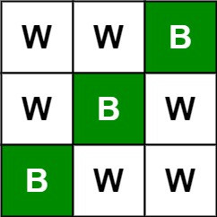

# 531. Lonely Pixel I - Medium

Given an `m x n` `picture` consisting of black `'B'` and white `'W'` pixels, return the number of black lonely pixels.

A black lonely pixel is a character `'B'` that located at a specific position where the same row and same column don't have any other black pixels.

##### Example 1:



```
Input: picture = [["W","W","B"],["W","B","W"],["B","W","W"]]
Output: 3
Explanation: All the three 'B's are black lonely pixels.
```

##### Example 2:


```
Input: picture = [["B","B","B"],["B","B","W"],["B","B","B"]]
Output: 0
```

##### Constraints:

- `m == picture.length`
- `n == picture[i].length`
- `1 <= m, n <= 500`
- `picture[i][j]` is `'W'` or `'B'`.

## Solution

```
# Time: O(mn)
# Space: O(1)
class Solution:
    def findLonelyPixel(self, picture: List[List[str]]) -> int:
        firstcol, m, n = 0, len(picture), len(picture[0])
        for i in range(m):
            for j in range(n):
                if picture[i][j] == 'B':
                    if j == 0:
                        firstcol += 1
                    else:
                        picture[0][j] = (i, picture[0][j]) if picture[0][j] in ['B', 'W'] else (None, picture[0][j][1])
                    picture[i][0] = (j, picture[i][0]) if picture[i][0] in ['B', 'W'] else (None, picture[i][0][1])
        result = 0
        for i in range(m):
            if picture[i][0] in ['B', 'W']:
                continue
            j, prevval = picture[i][0]
            if j is not None:
                if j == 0:
                    if firstcol == 1:
                        result += 1
                elif picture[0][j] not in ['B', 'W']:
                    i2, _ = picture[0][j]
                    if i2 is not None:
                        result += 1
            picture[i][0] = prevval
        for j in range(1, n):
            if picture[0][j] not in ['B', 'W']:
                picture[0][j] = picture[0][j][1]
        
        return result
```

## Notes
- We can achieve constant space for an otherwise linear space solution problem by using the technique of storing information about rows and columns in the first row of each row/column, with the caveat that the first row or first column information must be stored in its own binding. In this problem, we store the singular black pixel location in each first cell for all rows and columns according to the aforementioned strategy, as well as the value that previously resided in the cell that is being used to tabulate information (this allows us to reset the input back to its original state once we have determined the number of lonely black pixels).
- As always, we should be careful about mutating inputs passed by reference.