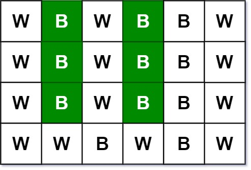

# 533. Lonely Pixel II - Medium

Given an `m x n` picture consisting of black `'B'` and white `'W'` pixels and an integer `target`, return the number of black lonely pixels.

A black lonely pixel is a character `'B'` that located at a specific position `(r, c)` where:

- Row `r` and column `c` both contain exactly `target` black pixels.
- For all rows that have a black pixel at column `c`, they should be exactly the same as row `r`.
- `1 <= target <= min(m, n)`

##### Example 1:



```
Input: picture = [["W","B","W","B","B","W"],["W","B","W","B","B","W"],["W","B","W","B","B","W"],["W","W","B","W","B","W"]], target = 3
Output: 6
Explanation: All the green 'B' are the black pixels we need (all 'B's at column 1 and 3).
Take 'B' at row r = 0 and column c = 1 as an example:
 - Rule 1, row r = 0 and column c = 1 both have exactly target = 3 black pixels. 
 - Rule 2, the rows have black pixel at column c = 1 are row 0, row 1 and row 2. They are exactly the same as row r = 0.
```

##### Example 2:


```
Input: picture = [["W","W","B"],["W","W","B"],["W","W","B"]], target = 1
Output: 0
```

##### Constraints:

- `m == picture.length`
- `n == picture[i].length`
- `1 <= m, n <= 200`
- `1 <= target <= min(m, n)`
- `picture[i][j]` is `'W'` or `'B'`.

## Solution

```
from collections import defaultdict

# Time: O(m^2 * n)
# Space: O(m^2 + mn)
class Solution:
    def findBlackPixel(self, picture: List[List[str]], target: int) -> int:
        m, n = len(picture), len(picture[0])
        rows, cols, samerows = defaultdict(int), defaultdict(int), set()
        for i in range(m):
            for k in range(i, m):
                if all(picture[i][j] == picture[k][j] for j in range(n)):
                    samerows.add((i, k))
                    samerows.add((k, i))
            for j in range(n):
                if picture[i][j] == 'B':
                    rows[i] += 1
                    cols[j] += 1
        result = 0
        for i in range(m):
            for j in range(n):
                if picture[i][j] == 'B' and rows[i] == target and cols[j] == target:
                    result += int(all((i, k) in samerows for k in range(m) if picture[k][j] == 'B'))
        return result
```

## Notes
- Just check each black cell according to the prompt requirements. We do preprocessing to find all of the rows that are the same as each other (this dominates time complexity). 
- We could achieve `O(mn)` time and space with a trie based approach to identifying identical rows instead of the set approach used above, where each level of the trie corresponds to a column of pixels in `picture`, and each node stores the indices of rows that have the same characters up to and including the letter of the node. The bottom level nodes of the trie once it is constructed would identify sets of identical rows. Once we have obtained these sets, we can check the ones with the correct number of black pixels rowwise for the correct number of black pixels columnwise for each black pixel in the identical rows. Not going to bother implementing because above passes due to small input size upper bound, and this problem is unpopular.