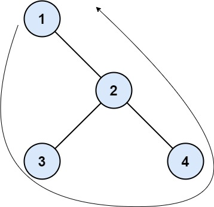

# 545. Boundary of Binary Tree - Medium

The boundary of a binary tree is the concatenation of the root, the left boundary, the leaves ordered from left-to-right, and the reverse order of the right boundary.

The left boundary is the set of nodes defined by the following:

- The root node's left child is in the left boundary. If the root does not have a left child, then the left boundary is empty.
- If a node in the left boundary and has a left child, then the left child is in the left boundary.
- If a node is in the left boundary, has no left child, but has a right child, then the right child is in the left boundary.
- The leftmost leaf is not in the left boundary.

The right boundary is similar to the left boundary, except it is the right side of the root's right subtree. Again, the leaf is not part of the right boundary, and the right boundary is empty if the root does not have a right child.

The leaves are nodes that do not have any children. For this problem, the root is not a leaf.

Given the `root` of a binary tree, return the values of its boundary.

##### Example 1:



```
Input: root = [1,null,2,3,4]
Output: [1,3,4,2]
Explanation:
- The left boundary is empty because the root does not have a left child.
- The right boundary follows the path starting from the root's right child 2 -> 4.
  4 is a leaf, so the right boundary is [2].
- The leaves from left to right are [3,4].
Concatenating everything results in [1] + [] + [3,4] + [2] = [1,3,4,2].
```

##### Example 2:


```
Input: root = [1,2,3,4,5,6,null,null,null,7,8,9,10]
Output: [1,2,4,7,8,9,10,6,3]
Explanation:
- The left boundary follows the path starting from the root's left child 2 -> 4.
  4 is a leaf, so the left boundary is [2].
- The right boundary follows the path starting from the root's right child 3 -> 6 -> 10.
  10 is a leaf, so the right boundary is [3,6], and in reverse order is [6,3].
- The leaves from left to right are [4,7,8,9,10].
Concatenating everything results in [1] + [2] + [4,7,8,9,10] + [6,3] = [1,2,4,7,8,9,10,6,3].
```

##### Constraints:

- The number of nodes in the tree is in the range <code>[1, 10<sup>4</sup>]</code>.
- `-1000 <= Node.val <= 1000`

## Solution

```
# Time: O(n)
# Space: O(h)
class Solution:
    def boundaryOfBinaryTree(self, root: Optional[TreeNode]) -> List[int]:
        result = [root.val]
        leaf = lambda node: not (node.left or node.right)
        def rec(node, lb, rb):
            nonlocal result
            isleaf = leaf(node)
            if lb and not isleaf:
                result.append(node.val)
            if node.left:
                if lb:
                    rec(node.left, not leaf(node.left), False)
                elif rb:
                    rec(node.left, False, not (leaf(node.left) or node.right))
                else:
                    rec(node.left, False, False)
            if node.right:
                if lb:
                    rec(node.right, not (leaf(node.right) or node.left), False)
                elif rb:
                    rec(node.right, False, not leaf(node.right))
                else:
                    rec(node.right, False, False)
            if rb or isleaf:
                result.append(node.val)

        if root.left:
            rec(root.left, True, False)
        if root.right:
            rec(root.right, False, True)
        return result
```

## Notes
- Preorder traverse the tree; collect left bound nodes before recursing down the tree, collect all leaves, collect right bound nodes after recursing down the tree.