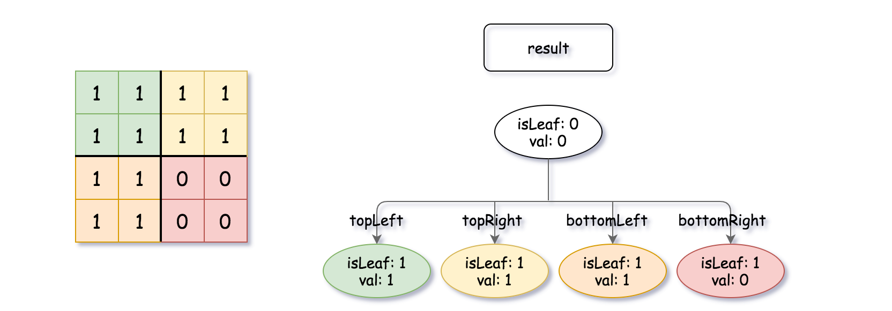

# 558. Logical OR of Two Binary Grids Represented as Quad-Trees - Medium

A Binary Matrix is a matrix in which all the elements are either `0` or `1`.

Given `quadTree1` and `quadTree2`. `quadTree1` represents a `n * n` binary matrix and `quadTree2` represents another `n * n` binary matrix.

Return a Quad-Tree representing the `n * n` binary matrix which is the result of logical bitwise OR of the two binary matrixes represented by `quadTree1` and `quadTree2`.

Notice that you can assign the value of a node to `True` or `False` when `isLeaf` is `False`, and both are accepted in the answer.

A Quad-Tree is a tree data structure in which each internal node has exactly four children. Besides, each node has two attributes:

- `val`: `True` if the node represents a grid of `1`'s or `False` if the node represents a grid of `0`'s.
- `isLeaf`: `True` if the node is leaf node on the tree or `False` if the node has the four children.

```
class Node {
    public boolean val;
    public boolean isLeaf;
    public Node topLeft;
    public Node topRight;
    public Node bottomLeft;
    public Node bottomRight;
}
```

We can construct a Quad-Tree from a two-dimensional area using the following steps:

- If the current grid has the same value (i.e all `1`'s or all `0`'s) set `isLeaf` True and set `val` to the value of the grid and set the four children to Null and stop.
- If the current grid has different values, set `isLeaf` to `False` and set `val` to any value and divide the current grid into four sub-grids as shown in the photo.
- Recurse for each of the children with the proper sub-grid.

Quad-Tree format:

The input/output represents the serialized format of a Quad-Tree using level order traversal, where `null` signifies a path terminator where no node exists below.

It is very similar to the serialization of the binary tree. The only difference is that the node is represented as a list `[isLeaf, val]`.

If the value of `isLeaf` or `val` is `True` we represent it as `1` in the list `[isLeaf, val]` and if the value of `isLeaf` or `val` is `False` we represent it as `0`.

##### Example 1:


```
Input: quadTree1 = [[0,1],[1,1],[1,1],[1,0],[1,0]]
, quadTree2 = [[0,1],[1,1],[0,1],[1,1],[1,0],null,null,null,null,[1,0],[1,0],[1,1],[1,1]]
Output: [[0,0],[1,1],[1,1],[1,1],[1,0]]
Explanation: quadTree1 and quadTree2 are shown above. You can see the binary matrix which is represented by each Quad-Tree.
If we apply logical bitwise OR on the two binary matrices we get the binary matrix below which is represented by the result Quad-Tree.
Notice that the binary matrices shown are only for illustration, you don't have to construct the binary matrix to get the result tree.
```


##### Example 2:

```
Input: quadTree1 = [[1,0]], quadTree2 = [[1,0]]
Output: [[1,0]]
Explanation: Each tree represents a binary matrix of size 1*1. Each matrix contains only zero.
The resulting matrix is of size 1*1 with also zero.
```

##### Constraints:

- `quadTree1` and `quadTree2` are both valid Quad-Trees each representing a `n * n` grid.
- <code>n == 2<sup>x</sup></code> where `0 <= x <= 9`.

## Solution

```
# Time: O(n) where n is max number of nodes in input quad tree
# Space: O(n)
class Solution:
    def intersect(self, quadTree1: 'Node', quadTree2: 'Node') -> 'Node':
        def rec(node1,  node2):
            tl = tr = bl = br = result = None
            if node1 and node2:
                if node1.isLeaf and node2.isLeaf:
                    return Node(node1.val or node2.val, True)
                if node1.isLeaf:
                    if node1.val:
                        return Node(node1.val, True)
                    else:
                        tl = rec(None, node2.topLeft)
                        tr = rec(None, node2.topRight)
                        bl = rec(None, node2.bottomLeft)
                        br = rec(None, node2.bottomRight)
                        result = Node(False, False, tl, tr, bl, br)
                elif node2.isLeaf:
                    if node2.val:
                        return Node(node2.val, True)
                    else:
                        tl = rec(node1.topLeft, None)
                        tr = rec(node1.topRight, None)
                        bl = rec(node1.bottomLeft, None)
                        br = rec(node1.bottomRight, None)
                        result = Node(False, False, tl, tr, bl, br)
                else:
                    tl = rec(node1.topLeft, node2.topLeft)
                    tr = rec(node1.topRight, node2.topRight)
                    bl = rec(node1.bottomLeft, node2.bottomLeft)
                    br = rec(node1.bottomRight, node2.bottomRight)
                    result = Node(False, False, tl, tr, bl, br)
            elif node1:
                if node1.isLeaf:
                    return Node(node1.val, True)
                else:
                    tl = rec(node1.topLeft, None)
                    tr = rec(node1.topRight, None)
                    bl = rec(node1.bottomLeft, None)
                    br = rec(node1.bottomRight, None)
                    result = Node(False, False, tl, tr, bl, br)
            else:
                if node2.isLeaf:
                    return Node(node2.val, True)
                else:
                    tl = rec(None, node2.topLeft)
                    tr = rec(None, node2.topRight)
                    bl = rec(None, node2.bottomLeft)
                    br = rec(None, node2.bottomRight)
                    result = Node(False, False, tl, tr, bl, br)
            ch = (tl, tr, bl, br)
            leaf = sum(c.isLeaf for c in ch) + sum(c.val == tl.val for c in ch) == 8
            return result if not leaf else Node(True, True)

        return rec(quadTree1, quadTree2)
```

## Notes
- Just explore all cases, could refactor to majorly cut down on lines but handling of various cases will not be as clear. Note how any node whose children are all leaves of the same value also become leaves, forgetting about the leaf children.