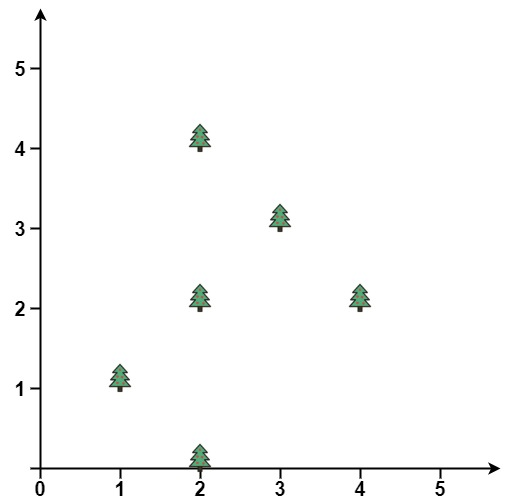
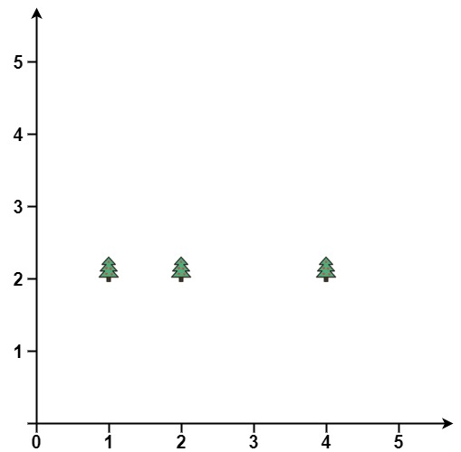

# 587. Erect the Fence - Hard

You are given an array `trees` where `trees[i] = [xi, yi]` represents the location of a tree in the garden.

Fence the entire garden using the minimum length of rope, as it is expensive. The garden is well-fenced only if all the trees are enclosed.

Return the coordinates of trees that are exactly located on the fence perimeter. You may return the answer in any order.

##### Example 1:



```
Input: trees = [[1,1],[2,2],[2,0],[2,4],[3,3],[4,2]]
Output: [[1,1],[2,0],[4,2],[3,3],[2,4]]
Explanation: All the trees will be on the perimeter of the fence except the tree at [2, 2], which will be inside the fence.
```

##### Example 2:



```
Input: trees = [[1,2],[2,2],[4,2]]
Output: [[4,2],[2,2],[1,2]]
Explanation: The fence forms a line that passes through all the trees.
```

##### Constraints:

- `1 <= trees.length <= 3000`
- `trees[i].length == 2`
- `0 <= xi, yi <= 100`
- All the given positions are unique.

## Solution

```
# Time: O(nlog(n))
# Space: O(n)
class Solution:
    def outerTrees(self, trees: List[List[int]]) -> List[List[int]]:
        def slopemorepos(p1, p2, p3): 
            return (p2[1] - p1[1]) * (p3[0] - p2[0]) - (p2[0] - p1[0]) * (p3[1] - p2[1]) > 0

        trees.sort()
        fence = []
        for tree in trees:
            while len(fence) > 1 and slopemorepos(fence[-2], fence[-1], tree):
                fence.pop()
            fence.append(tuple(tree))
        for tree in reversed(trees):
            while len(fence) > 1 and slopemorepos(fence[-2], fence[-1], tree):
                fence.pop()
            fence.append(tuple(tree))

        return [list(t) for t in set(fence)]
```

## Notes
- This question involves the concept of convex hull. This refers to the perimeter around some set of points in a cartesian plane such that the perimeter is composed of straight lines between certain points in the set of points and none of the angles between lines in the perimeter are `> 180 degrees`. If we sort the points and iterate LTR we can use a stack (`fence`) to obtain the points on the bottom half of the fence by considering the slopes of the most recent line in the fence (`fence[-2]` and `fence[-1]`) and the line created by `fence[-1]` and the current point. As we iterate, we want to remove any points from the stack that cause a relative decrease in slope between these two lines, because this would result in a non-convex hull. In other words, any points in the fence that cause a non-convex hull as we iterate cannot be in the final fence. To get the top half of the final fence, we iterate RTL with the same logic.