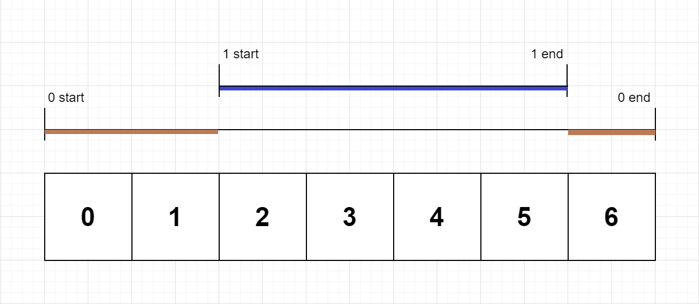

# 636. Exclusive Time of Functions - Medium

On a single-threaded CPU, we execute a program containing `n` functions. Each function has a unique ID between `0` and `n-1`.

Function calls are stored in a call stack: when a function call starts, its ID is pushed onto the stack, and when a function call ends, its ID is popped off the stack. The function whose ID is at the top of the stack is the current function being executed. Each time a function starts or ends, we write a log with the ID, whether it started or ended, and the timestamp.

You are given a list `logs`, where `logs[i]` represents the `i`th log message formatted as a string `"{function_id}:{"start" | "end"}:{timestamp}"`. For example, `"0:start:3"` means a function call with function ID `0` started at the beginning of timestamp `3`, and `"1:end:2"` means a function call with function ID `1` ended at the end of timestamp `2`. Note that a function can be called multiple times, possibly recursively.

A function's exclusive time is the sum of execution times for all function calls in the program. For example, if a function is called twice, one call executing for `2` time units and another call executing for `1` time unit, the exclusive time is `2 + 1 = 3`.

Return the exclusive time of each function in an array, where the value at the `i`th index represents the exclusive time for the function with ID `i`.

##### Example 1:


```
Input: n = 2, logs = ["0:start:0","1:start:2","1:end:5","0:end:6"]
Output: [3,4]
Explanation:
Function 0 starts at the beginning of time 0, then it executes 2 for units of time and reaches the end of time 1.
Function 1 starts at the beginning of time 2, executes for 4 units of time, and ends at the end of time 5.
Function 0 resumes execution at the beginning of time 6 and executes for 1 unit of time.
So function 0 spends 2 + 1 = 3 units of total time executing, and function 1 spends 4 units of total time executing.
```

##### Constraints:

- <code>0 <= n <= 100</code>
- <code>1 <= logs.length <= 500</code>
- `0 <= function_id < n`
- <code>0 <= timestamp <= 10<sup>9</sup></code>
- No two start events will happen at the same timestamp.
- No two end events will happen at the same timestamp.
- Each function has an `"end"` log for each `"start"` log.

## Solution

```
class Node:
    def __init__(self, fid, start, end=None):
        self.children = []
        self.fid = fid
        self.start = start
        self.end = end

# Time: O(m) where m == len(logs)
# Space: O(m)
class Solution:
    def exclusiveTime(self, n: int, logs: List[str]) -> List[int]:
        result = [0] * n
        root = Node(-1, -1)
        stack = [root]
        for log in logs:
            fid, log_type, timestamp = log.split(":")
            if log_type == "start":
                call_node = Node(int(fid), int(timestamp))
                stack[-1].children.append(call_node)
                stack.append(call_node)
            else:
                stack[-1].end = int(timestamp)
                stack.pop()
        
        def rec(node):
            nonlocal result

            children_time = 0
            for child in node.children:
                children_time += rec(child)

            total_time = node.end - node.start + 1
            exclusive_time = total_time - children_time
            result[node.fid] += exclusive_time

            return total_time
        
        for node in root.children:
            rec(node)
        return result

```

## Notes
- Tricky because we are asked for exclusive function times, so for a given call you need to determine how much time was spent calling other functions and then subtract that from the total time for the call. This is simple to do if we parse the calls into a tree data structure and then traverse it recursively.