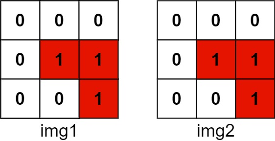

# 835. Image Overlap - Medium

You are given two images, `img1` and `img2`, represented as binary, square matrices of size `n x n`. A binary matrix has only `0`s and `1`s as values.

We translate one image however we choose by sliding all the `1` bits left, right, up, and/or down any number of units. We then place it on top of the other image. We can then calculate the overlap by counting the number of positions that have a `1` in both images.

Note also that a translation does not include any kind of rotation. Any `1` bits that are translated outside of the matrix borders are erased.

Return the largest possible overlap.

##### Example 1:




```
Input: img1 = [[1,1,0],[0,1,0],[0,1,0]], img2 = [[0,0,0],[0,1,1],[0,0,1]]
Output: 3
```

##### Example 2:

```
Input: img1 = [[1]], img2 = [[1]]
Output: 1
```

##### Example 3:

```
Input: img1 = [[0]], img2 = [[0]]
Output: 0
```

##### Constraints:

- `n == img1.length == img1[i].length`
- `n == img2.length == img2[i].length`
- `1 <= n <= 30`
- `img1[i][j] is either 0 or 1.`
- `img2[i][j] is either 0 or 1.`

## Solution

```
# Time: O(n^4)
# Space: O(n^4)

from collections import defaultdict

class Solution:
    def largestOverlap(self, A: List[List[int]], B: List[List[int]]) -> int:
        n = len(A)
        a1s, b1s = [], []
        for i in range(n):
            for j in range(n):
                if A[i][j] == 1:
                    a1s.append((i, j))
                if B[i][j] == 1:
                    b1s.append((i, j))

        shifts, result = defaultdict(int), 0
        for ai, aj in a1s:
            for bi, bj in b1s:
                shift = (ai - bi, aj - bj)
                shifts[shift] += 1
                result = max(result, shifts[shift])
        return result
```

## Notes
- Consider for all pairs of 1-bits from each image, the shift that would be required to make them overlap. Note the quartic space and time, because there are O(n^2) possible shifts in the x-direction and O(n^2) possible shifts in the y-direction.